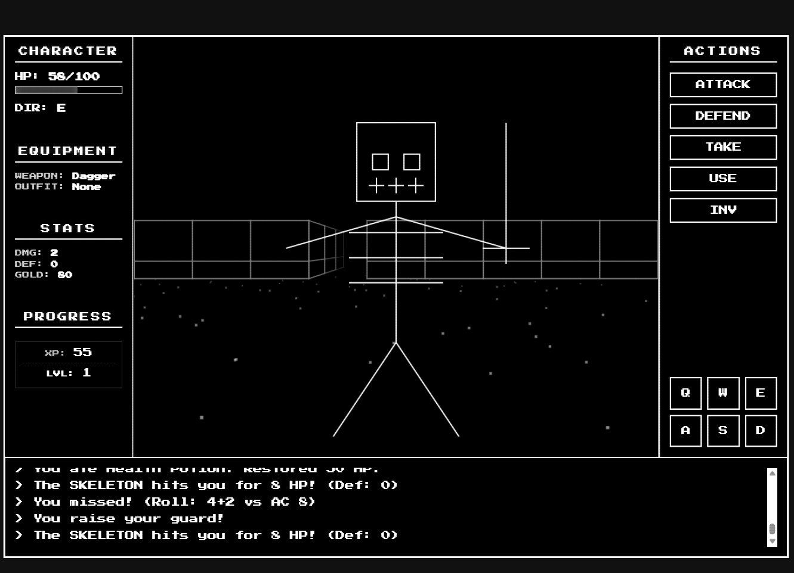

# MONOLITH 🏛️

A professional, high-performance pseudo-3D dungeon crawler engine built with Vanilla JavaScript and HTML5 Canvas. Now featuring a signature **Raw Retro Vector** aesthetic.

<p align="center">
  
  <br>
  <em>The new high-fidelity vector/wireframe rendering pipeline.</em>
</p>

## 🎮 Overview

**Monolith** is a technical showcase of first-person dungeon crawler (DRPG) mechanics. It features a custom rendering pipeline that simulates a 3D perspective using perspective-correct transformations, billboarding, and distance-based atmospheric effects.

The project has evolved into a fully **Vector-Based** experience, replacing legacy PNG textures with dynamic geometric wireframes for a sharp, minimalist retro aesthetic.

### Key Features
- **Raw Retro Vector Engine**: High-performance geometric rendering with sub-pixel precision.
- **Perspective-Correct Decals**: Interactive objects (like levers) are projected directly onto wall surfaces.
- **Dynamic Sprite Pipeline**: Monsters and items are rendered as high-fidelity wireframe billboards.
- **Multi-Stop Atmospheric Fog**: Advanced distance-based visibility rendering.
- **Enhanced UI Layout**: Optimized sidebar panels with dedicated XP, Level, and Gold tracking.
- **Unified RPG Data Layer**: Centralized entity registry for monsters and loot.

---

## 🚀 Getting Started

Follow these steps to get the game running on your local machine.

### Prerequisites
- [Node.js](https://nodejs.org/) (Latest LTS recommended)
- [Git](https://git-scm.com/)

### Installation
1. **Clone the repository:**
   ```bash
   git clone https://github.com/Samrude1/Retro_Adventure.git
   cd Retro_Adventure
   ```

2. **Install dependencies:**
   ```bash
   npm install
   ```

3. **Start the development server:**
   ```bash
   npm run dev
   ```

4. **Play:**
   Open your browser and navigate to `http://localhost:5173` (or the port shown in your terminal).

---

## 🕹️ How to Play

Explore the depths of the Monolith, defeat monsters, and find your way to the deeper floors.

### Controls
| Action | Keyboard | UI Button |
| :--- | :--- | :--- |
| **Move Forward** | `W` / `↑` | `UP` |
| **Move Backward** | `S` / `↓` | `DOWN` |
| **Strafe** | `A` / `D` | - |
| **Turn Left/Right** | `Q` / `E` | `LEFT` / `RIGHT` |
| **Interact / Use** | `F` / `Space` | `USE` |
| **Attack** | - | `ATTACK` |
| **Defend / Parry** | - | `DEFEND` |
| **Inventory** | - | `INV` |

### Gameplay Mechanics
- **Exploration**: Use the movement keys to navigate the grid-based dungeon. Look for stairs to go up (`<`) or down (`>`).
- **Combat**: When facing a monster, use **ATTACK** to strike. Use **DEFEND** to raise your guard—timing it right can result in a **Perfect Parry**!
- **Levers & Objects**: Use **F** or **Space** to interact with wall-mounted levers and other environmental objects.
- **Inventory**: Pick up items (gold, weapons, food) using **TAKE**. Open your **INV** to equip gear or consume items.
- **Leveling**: Gain XP by defeating monsters to increase your Max HP and stats.

---

## 🛠️ Technical Stack
- **Engine**: Vanilla ES6+ JavaScript.
- **Graphics**: HTML5 Canvas (Geometric stroke rendering).
- **Tooling**: [Vite](https://vitejs.dev/) for fast development and bundling.
- **Architecture**: Modular "Manager" pattern (Engine, LevelManager, SoundManager).

---

## 📅 Status (2026-05-12)
The engine has transitioned to a "Raw Retro" state. All legacy raster textures have been removed in favor of a clean, high-fidelity vector look.

### Current Priorities:
1. **Procedural Elements**: Adding map generation capabilities for infinite dungeons.
2. **Persistence**: Integrating `localStorage` for floor progress and character state.
3. **Advanced Interactivity**: Expanding the lever/switch system for puzzle mechanics.

---
*Architected for expansion. Optimized for performance.*
