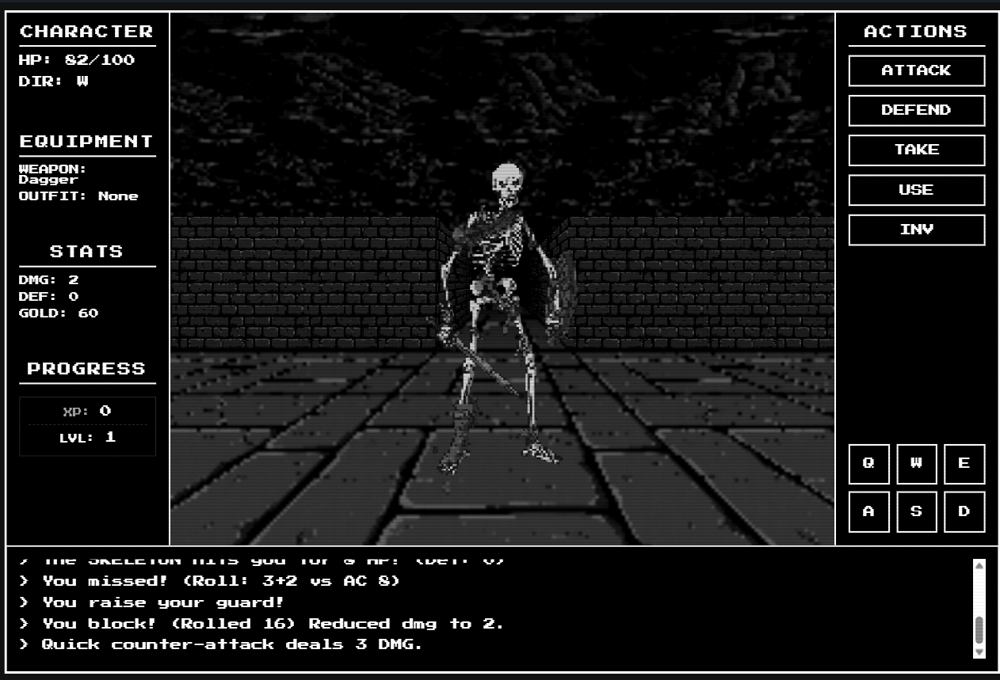

# MONOLITH 🏛️

A professional, high-performance pseudo-3D dungeon crawler engine built with Vanilla JavaScript and HTML5 Canvas. Now featuring a **1990s Modern** textured aesthetic.

<p align="center">
  
  <br>
  <em>The new high-fidelity vector/wireframe rendering pipeline.</em>
</p>

<p align="center">
  
  <br>
  <em>Dynamic interaction and entity rendering.</em>
</p>

## 🎮 Overview

**Monolith** is a technical showcase of first-person dungeon crawler (DRPG) mechanics. It features a custom rendering pipeline that simulates a 3D perspective using perspective-correct transformations, billboarding, and distance-based atmospheric effects.

The project has evolved into a **1990s Modern** experience, bringing back classic PNG textures for walls, floors, ceilings, items, and monsters for an immersive aesthetic.

### Key Features
- **Raw Retro Vector Engine**: High-performance geometric rendering with sub-pixel precision.
- **Perspective-Correct Decals**: Interactive objects (like levers) are projected directly onto wall surfaces.
- **Dynamic Sprite Pipeline**: Monsters and items are rendered as high-fidelity wireframe billboards.
- **Multi-Stop Atmospheric Fog**: Advanced distance-based visibility rendering.
- **Enhanced UI Layout**: Optimized sidebar panels with dedicated XP, Level, and Gold tracking.
- **Unified RPG Data Layer**: Centralized entity registry for monsters and loot.

---

## 🚀 Getting Started

Follow these steps to get the game running on your local machine.

### Prerequisites
- [Node.js](https://nodejs.org/) (Latest LTS recommended)
- [Git](https://git-scm.com/)

### Installation
1. **Clone the repository:**
   ```bash
   git clone https://github.com/Samrude1/Retro_Adventure.git
   cd Retro_Adventure
   ```

2. **Install dependencies:**
   ```bash
   npm install
   ```

3. **Start the development server:**
   ```bash
   npm run dev
   ```

4. **Play:**
   Open your browser and navigate to `http://localhost:5173` (or the port shown in your terminal).

---

## 🕹️ How to Play

Explore the depths of the Monolith, defeat monsters, and find your way to the deeper floors.

### Controls
| Action              | Keyboard      | UI Button        |
| :------------------ | :------------ | :--------------- |
| **Move Forward**    | `W` / `↑`     | `UP`             |
| **Move Backward**   | `S` / `↓`     | `DOWN`           |
| **Strafe**          | `A` / `D`     | -                |
| **Turn Left/Right** | `Q` / `E`     | `LEFT` / `RIGHT` |
| **Interact / Use**  | `F` / `Space` | `USE`            |
| **Attack**          | -             | `ATTACK`         |
| **Defend / Parry**  | -             | `DEFEND`         |
| **Inventory**       | -             | `INV`            |

### Gameplay Mechanics
- **Exploration**: Use the movement keys to navigate the grid-based dungeon. Look for stairs to go up (`<`) or down (`>`).
- **Combat**: When facing a monster, use **ATTACK** to strike. Use **DEFEND** to raise your guard—timing it right can result in a **Perfect Parry**!
- **Levers & Objects**: Use **F** or **Space** to interact with wall-mounted levers and other environmental objects.
- **Inventory**: Pick up items (gold, weapons, food) using **TAKE**. Open your **INV** to equip gear or consume items.
- **Leveling**: Gain XP by defeating monsters to increase your Max HP and stats.

---

## 🛠️ Technical Stack & Implementation

### Core Technologies
- **Engine**: Vanilla ES6+ JavaScript.
- **Graphics**: HTML5 Canvas (Geometric stroke rendering).
- **Tooling**: [Vite](https://vitejs.dev/) for fast development and bundling.
- **Architecture**: Modular "Manager" pattern (Engine, LevelManager, SoundManager).

---

### Technical Implementation

**3D Engine Technology**
The engine is built using pure **Vanilla JavaScript** and the **HTML5 Canvas API**. It does not use external 3D libraries (like Three.js); instead, it implements perspective mathematically:
- **Pseudo-3D Rendering**: Although the engine operates on a grid, it uses perspective-correct transformations and the "Painter's Algorithm" for depth management (drawing the furthest objects first).
- **Texture Rendering**: The engine projects 3D coordinates onto a 2D plane and draws walls as dynamic trapezoids, supporting full raster textures for walls and billboards for entities to create a 1990s aesthetic.
- **Performance**: Optimized for smooth browser performance, the engine utilizes efficient distance-based fog effects and visibility culling (only surfaces near the player are calculated).

**Building Levels from ASCII Files**
The game reads level structures directly from ASCII text files (e.g., `Level.txt`):
1. **Loading and Parsing**: `engine.js` fetches the text file (e.g., `Level1.txt`) and converts it character-by-character into a 2D array (Grid).
2. **Symbols**: Each character represents a specific element in the game world:
   - `#` : Wall
   - `.` : Floor
   - `D` : Closed door (Interactive obstacle)
   - `d` : Open door (Walkable)
   - `S` : Player spawn point
   - `>` / `<` : Stairs down/up
3. **Rendering Process**: During rendering, the engine scans the grid within the player's field of view. It identifies wall faces whenever a solid cell (`#` or `D`) is adjacent to an empty space. These faces are sorted by distance and drawn in order to create a proper sense of depth.

---

## 📅 Status (2026-06-16)
The engine has transitioned back to a "1990s Modern" state. Raster textures have been re-enabled for walls, floors, ceilings, and entities to create a rich graphical experience.

### Current Priorities:
1. **Procedural Elements**: Adding map generation capabilities for infinite dungeons.
2. **Persistence**: Integrating `localStorage` for floor progress and character state.
3. **Advanced Interactivity**: Expanding the lever/switch system for puzzle mechanics.

---
*Architected for expansion. Optimized for performance.*
